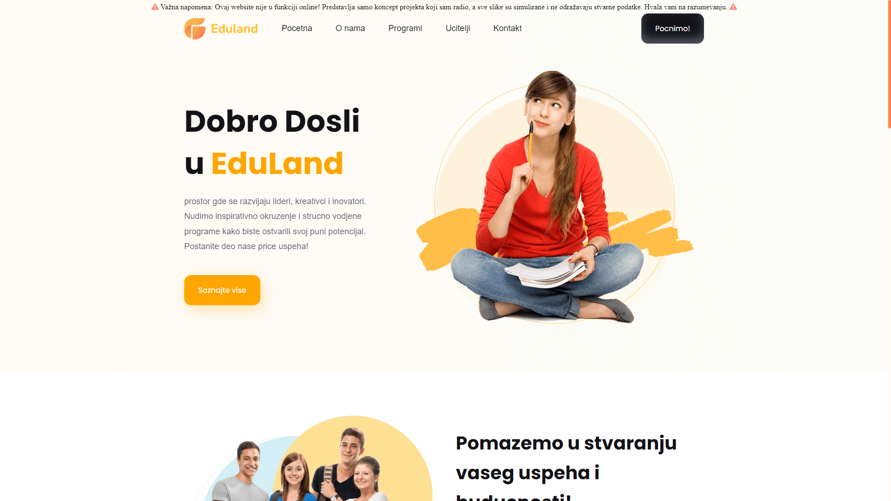

<p align="center">
  
</p>

<p align="center">
  Eduland is an engaging and informative educational platform designed to empower learners with knowledge and skills across various subjects. From interactive lessons to quizzes and resources, the website offers a comprehensive learning experience. It is optimized for a user-friendly interface, where students can easily navigate through different courses and materials. Whether you're looking to enhance your skills in a specific field or just want to explore new areas of knowledge, Eduland is the ideal place to start your educational journey. With a focus on accessibility and interactive learning, Eduland brings education closer to everyone, anywhere, anytime.
</p>

<p align="center">
  <a href="https://eduland.milanwebportal.com">
    
  </a>
</p>

<hr>

## 📸 Screenshot



<hr>

## 🚀 Technologies

- HTML5  
- CSS3  
- JavaScript  
- Responsive Design  
- Google Fonts

<hr>

## 🎯 Features

- 💡 Interactive learning modules
- 📱 Fully responsive layout (mobile, tablet, desktop)
- 📝 Course materials and quizzes
- 📚 Resource library
- 📍 Contact page with map

<hr>

## ⚙️ Installation (Local)

```bash
git clone https://github.com/Milan-petkovski/Eduland.git
cd Eduland
open index.html
```

<hr>

## 📄 License

**All files and design are the property of Milan Petkovski.**
<br>
The code is open for viewing but not allowed to be downloaded, modified, or used for commercial purposes without permission.

<hr>

## ✉️ Contact

For more information or collaboration:
<br>
🌐 [milanwebportal.com](https://milanwebportal.com)
<br>
📧 [contact@milanwebportal.com](mailto:contact@milanwebportal.com)
<br><br>

> Made with ❤️ by Milan Petkovski
